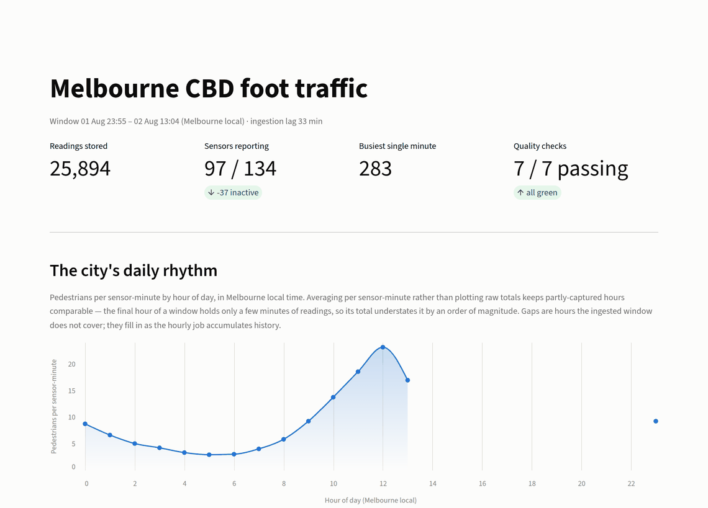
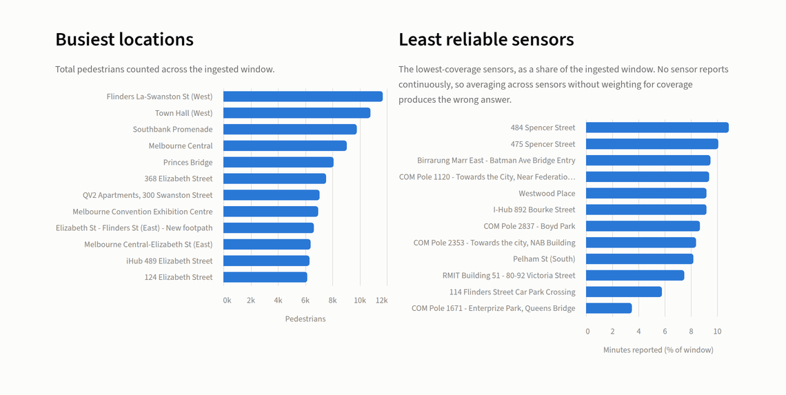
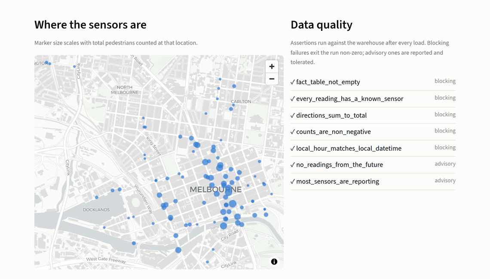

# Melbourne Pedestrian Pipeline

[](https://github.com/sagameko/pedestrian-pipeline/actions/workflows/ci.yml)
[](https://github.com/sagameko/pedestrian-pipeline/actions/workflows/ingest.yml)
[](https://www.python.org/downloads/)
[](LICENSE)

A scheduled ingestion pipeline that builds a durable history of Melbourne CBD foot traffic from
the City of Melbourne's live pedestrian sensor network.

The source API only exposes a **rolling window** — old readings fall off and are gone. The point of
this pipeline is to run hourly, capture each window, and accumulate the history the API itself
doesn't keep. Because consecutive runs overlap, every load has to be idempotent.

**Stack:** Python 3.12 · httpx · Pydantic · Polars · DuckDB · Streamlit · pytest · Ruff · GitHub Actions


---

## Why this dataset is interesting

Three constraints in the source data shape the entire design. Each one silently corrupts a naive
implementation.

### 1. The obvious endpoint cannot read the dataset

The Explore v2.1 API's `/records` endpoint enforces `offset + limit <= 10,000`. The counts dataset
holds ~25,900 rows. Paging through it doesn't error — it just **stops at 39% of the data** and
returns success.

```
GET /records?limit=100&offset=10000
→ 400  "sum of offset + limit ... <= 10000 is expected"
```

The pipeline uses `/exports/json?limit=-1` instead, which streams the complete dataset in one
request. This is the only complete read the API offers.
→ [`sources/melbourne.py`](src/pedestrian_pipeline/sources/melbourne.py)

### 2. The source restates readings under the same key

`(location_id, sensing_datetime)` is the natural primary key, but the source publishes conflicting
values for it — 13 collisions in a typical window:

| location_id | sensing_datetime | direction_1 | direction_2 | total |
|---|---|---|---|---|
| 11 | 2026-08-02T02:00:00Z | 2 | 1 | 3 |
| 11 | 2026-08-02T02:00:00Z | 10 | 4 | 14 |

These are not duplicate rows — they're a partial reading followed by a fuller one. A blind
`drop_duplicates()` keeps whichever arrives first and silently discards real pedestrians.

The API exposes no version or ingestion timestamp to disambiguate, so the pipeline resolves
deterministically to the **highest total**, treating the larger count as the more complete reading,
and reports the number of restated keys in every run summary so the ambiguity stays visible rather
than being quietly swallowed.
→ [`transform.py`](src/pedestrian_pipeline/transform.py)

### 3. Melbourne changes UTC offset twice a year

The API returns UTC, plus pre-computed `sensing_date` / `sensing_time` fields in local time. Those
local fields are `UTC+10` in August (AEST) and `UTC+11` in January (AEDT). Hardcoding either offset
puts half the year an hour out and quietly misattributes readings across the midnight boundary.

Local columns are derived through the `Australia/Melbourne` zone rather than a fixed offset, and
[a test pins both sides of the DST switch](tests/test_transform.py).

There's a second, sneakier half to this. DuckDB resolves `TIMESTAMPTZ` against the *session*
timezone, which it inherits from the host clock — so `extract('hour' FROM local_datetime)` returned
a Melbourne hour on a Melbourne laptop and a UTC hour on a UTC CI runner, from byte-identical data.
The quality gate passed locally and failed in CI. The warehouse now pins its session timezone on
connect, and [the timezone tests](tests/test_timezone.py) run under a forced non-Melbourne `TZ` so
the discrepancy can't come back unnoticed.

---

## Architecture

```
Melbourne Open Data API
        │   exports/json — full dataset, no pagination cap
        ▼
  sources/melbourne.py    retry with exponential backoff, rate-limit aware
        │   list[dict]
        ▼
      models.py           Pydantic validation; bad records quarantined, not fatal
        │   list[PedestrianCount]
        ▼
     transform.py         Polars: restatement resolution, AEST/AEDT local columns
        │   DataFrame
        ▼
     warehouse.py         DuckDB star schema, idempotent upsert on the natural key
        │
        ▼
      quality.py          7 post-load assertions; errors fail the run
        │
        ├─────────────────▶ analytics/     named SQL over the star schema (CLI)
        └─────────────────▶ dashboard.py   Streamlit read layer (read-only)
```

Every stage is independently testable, and the HTTP layer is the only one that touches the network.

### Data model

```
dim_sensor                          fact_pedestrian_count
─────────────────────               ─────────────────────────────
location_id        PK  ◄────────────  location_id          PK
sensor_description                    sensing_datetime     PK  (UTC)
sensor_name                           local_datetime           (Australia/Melbourne)
status                                local_date
latitude, longitude                   local_hour
location_type                         direction_1
installation_date                     direction_2
direction_1_label                     total_of_directions
direction_2_label                     ingested_at
note
ingested_at
```

The sensor dataset reuses the names `direction_1` / `direction_2` for compass *labels* while the
counts dataset uses them for *magnitudes*. They're renamed to `direction_1_label` on ingest so a
join can't produce two columns with the same name and different meanings.

---

## Quick start

Requires [uv](https://docs.astral.sh/uv/) and Python 3.12+. No credentials — the API is open.

```bash
uv sync
```

Run the pipeline:

```bash
uv run ingest
```

```
ingestion summary
  sensors loaded      134
  readings fetched    25907
  readings loaded     25894
  restated keys       13
  rejected records    0
  fact rows in store  25894
  [   pass] fact_table_not_empty
  [   pass] every_reading_has_a_known_sensor
  [   pass] directions_sum_to_total
  [   pass] counts_are_non_negative
  [   pass] local_hour_matches_local_datetime
  [   pass] no_readings_from_the_future
  [   pass] most_sensors_are_reporting
```

Run it again and the row count doesn't move — overlapping windows upsert rather than duplicate.

Query the warehouse:

```bash
uv run report
```

```bash
uv run report busiest_sensors
```

```bash
uv run report --list
```

---

## Dashboard

A Streamlit read layer over the same warehouse, installed as an optional extra so the
pipeline itself stays lean:

```bash
uv sync --extra dashboard
```

```bash
uv run streamlit run src/pedestrian_pipeline/dashboard.py
```

It opens the warehouse **read-only**, so it can run against the same file while a
scheduled ingest is writing to it, and cannot alter what it displays.

### Foot traffic by hour



Plotted as **pedestrians per sensor-minute**, not raw totals. Raw totals make a
partly-captured hour look like a collapse in foot traffic — the final hour of a window
holds only a few minutes of readings, so its total understates it roughly tenfold.
Hours the window doesn't cover break the line instead of being drawn as a plausible
zero, and the isolated point at 23:00 is a real observation that a line mark alone
would have rendered as nothing.

### Rankings and reliability



Ranked bars share a single hue — colour carries identity, not magnitude, and the bar
length already encodes the value. The right-hand chart is the one that matters
analytically: coverage across sensors spans a 27× range, so any average taken across
sensors without weighting for coverage is wrong.

### Network and data quality



The quality panel is the same `quality.py` gate the pipeline runs after every load, so
the dashboard and the CLI can never disagree about whether the data is sound. Checks
are labelled **blocking** or **advisory** rather than by severity name — a green tick
beside the word "error" reads as a failure.

### How these screenshots are produced

They're a build artifact, not hand-taken, so they can't drift from the app:

```bash
uv run --extra dashboard --extra screenshots python scripts/capture_screenshots.py
```

The standard the script enforces:

| Requirement | Why |
|---|---|
| Real data from a real run | Placeholder or lorem content is the fastest way to look unfinished |
| Captured at 2×, downsampled to 1× | Text stays crisp on high-DPI screens without shipping a multi-megabyte PNG |
| Framework chrome hidden | The "Deploy" button and hamburger menu are Streamlit's furniture, not the product |
| Cropped to content | No browser bars, no OS window frame, no trailing dead space |
| Fixed 1440px capture width | Every shot lines up at the same scale; layout can't shift between them |
| Under ~350 KB each | A repo shouldn't carry megabytes of images |
| Descriptive alt text | Screen readers, and a fallback when images fail to load |
| Regenerated by one command | Screenshots that can't be reproduced go stale the first time the UI changes |

---

## What the data says

Foot traffic across the CBD, by hour of day in local time — a recognisable city rhythm, with the
overnight trough at 4–5am and the lunchtime peak an order of magnitude above it:

```
 hour   sensors   pedestrians
   04        80         3,074
   05        87         2,539   ← quietest
   08        97        13,889
   10        97        42,044
   12        96        73,043   ← peak
```

Sensor reliability varies far more than a headline uptime figure would suggest. Not one sensor
reported every minute, and over the same 790-minute window coverage spans a 27× range:

```
Flinders La-Swanston St (West)      744 / 790 minutes   94.2%   ← best
Town Hall (West)                    710 / 790 minutes   89.9%
...
114 Flinders Street Car Park         46 / 790 minutes    5.8%
COM Pole 1671 - Enterprize Park      28 / 790 minutes    3.5%   ← worst
```

Only 97 of 134 registered sensors reported at all. Any analysis that averages across sensors
without weighting for coverage will be wrong, which is why `sensor_coverage` ships as a
first-class query rather than a footnote.

The dataset is also misnamed: `past-hour-counts-per-minute` actually returns a **~13-hour** window.
The pipeline never assumes a window length — it takes whatever the export returns and upserts it.

---

## Data quality

Seven assertions run against the warehouse after every load.
`error` fails the run with a non-zero exit code; `warning` is reported but tolerated.

| Check | Severity |
|---|---|
| `fact_table_not_empty` | error |
| `every_reading_has_a_known_sensor` | error |
| `directions_sum_to_total` | error |
| `counts_are_non_negative` | error |
| `local_hour_matches_local_datetime` | error |
| `no_readings_from_the_future` | warning |
| `most_sensors_are_reporting` | warning |

Validation happens in two places on purpose. Pydantic rejects malformed records at the boundary and
quarantines them individually, so one bad row can't fail a 25,000-row run. The SQL checks then
assert invariants against what actually landed, which also catches anything written to the warehouse
outside this pipeline.

---

## Testing

```bash
uv run pytest
```

72 tests. Every HTTP interaction is mocked with `respx`, so the suite is fast, deterministic, and
needs no network — including the retry, timeout, and malformed-payload paths that are impractical
to trigger against the live API.

Coverage is 88% overall: every pipeline module sits at 98–100%, and the shortfall is the
Streamlit render function, which is UI wiring rather than logic. The dashboard's chart builders
are pure functions and *are* tested — including the assertion that the hourly chart plots the
normalised measure rather than raw totals.

The tests worth reading are the ones pinning the three constraints above:
[restatement resolution and DST correctness](tests/test_transform.py), and
[upsert idempotency](tests/test_warehouse.py).

---

## Scheduling

[`.github/workflows/ingest.yml`](.github/workflows/ingest.yml) runs the pipeline hourly, caching the
DuckDB file between runs so history accumulates, and publishes a freshness report to the workflow
summary. [`.github/workflows/ci.yml`](.github/workflows/ci.yml) runs Ruff and the test suite on
Python 3.12 and 3.13.

Nothing about the pipeline is GitHub-specific — `uv run ingest` is a single idempotent command, so
cron, systemd, or any orchestrator works the same way.

---

## Design notes

**Why DuckDB?** The workload is analytical, single-writer, and embedded. DuckDB gives real SQL,
proper `TIMESTAMPTZ` handling, and `ON CONFLICT` upserts in a single file with no server to run.

**Why Polars?** Transformations are columnar, and resolving restatements is a sort-and-dedupe over
~26,000 rows. Polars expresses it directly and hands off to DuckDB through Arrow without a copy.

**Why validate twice?** See [Data quality](#data-quality) — boundary validation and warehouse
invariants catch different failures.

**Known limitation.** Resolving restatements by highest total is a judgement call, not a documented
source guarantee. If the City of Melbourne ever adds a revision timestamp, ordering by it would be
strictly better. The current rule is deterministic and its effects are reported on every run.

---

## Source

City of Melbourne Open Data — [Pedestrian Counting System](https://data.melbourne.vic.gov.au/explore/dataset/pedestrian-counting-system-past-hour-counts-per-minute/),
licensed CC BY 4.0. No authentication required; the API allows 5,000 requests/day and this pipeline
uses two per run.

## License

MIT — see [LICENSE](LICENSE).
